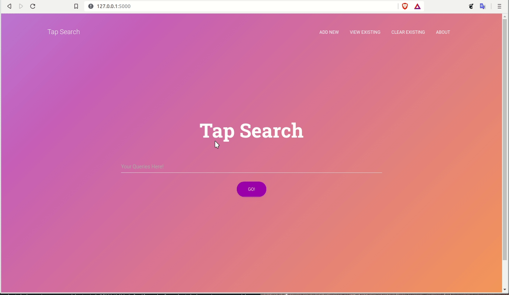

# Description
TapSearch is a minimalstic search engine written in Python. It uses feature extraction from a set of documents and give results accordingly to the user. Deployed on heroku [here](https://tapsearch612-api-heroku.herokuapp.com)

## Tech Stack
- Flask-Admin
- SqlAlchemy (Object Relational Mapper)
- Material Kit
- Sqlite3
- Natural Language Toolkit (NLTK)

## Features
- Text Search
- PDF Search (_Bit Buggy_)
- Image Search  (_yet to be implemented_)

## Instructions for running
_Heroku deployment is a bit buggy for some reasons, it might crash_, for running in local host instructions are as follows:

- Clone the project using `git clone git@github.com:mayankDhiman/TapSearch.git`
- Install required dependencies using `pip install -r requirements.txt`
- Run `flask run` in projects root directory
- Run local host in your machine `http://127.0.0.1:5000/`
- Add the text by using "Add New" option in Navigation Bar
- Once done, you will be able to search for some word.
- Same way a PDF file can also be uploaded & used in it.

